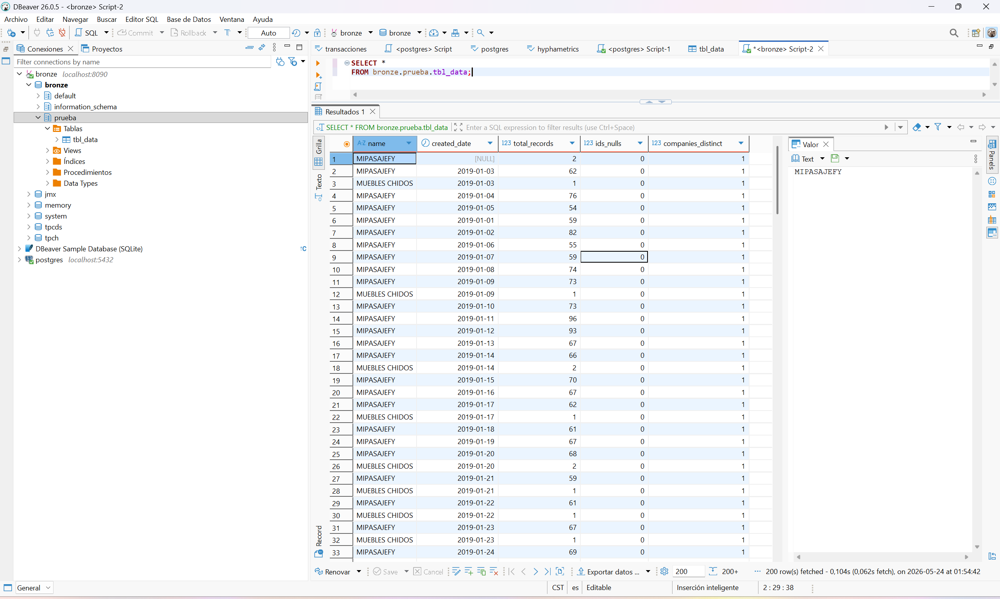

# Ejercicio 1 - Airflow + MinIO + Trino

## Descripción

Este ejercicio implementa un pipeline ETL utilizando **Airflow**, **MinIO** y **Trino**.

El objetivo es leer un archivo CSV con transacciones históricas, detectar y corregir inconsistencias básicas, realizar agregaciones sobre los campos `name` y `created_at`, guardar el resultado en formato Parquet dentro de MinIO y disponibilizarlo para consulta SQL mediante Trino.

---

## Arquitectura propuesta


## DAG de Airflow

El DAG creado es el siguiente:


## Preguntas adicionales

### 1. Para los ids nulos ¿Qué sugieres hacer con ellos?

Durante el procesamiento se detectaron **3 registros con id nulo**.

Para este caso no se recomienda eliminar automáticamente los registros, ya que pueden contener información útil para análisis agregados. Tampoco se recomienda inventar un id de cliente, porque los ids representan usuarios enmascarados mediante hash y crear un valor artificial podría generar una interpretación incorrecta de los datos.

La estrategia aplicada fue conservar los registros y contabilizarlos mediante el campo agregado `ids_nulls`.

Para una siguiente versión del pipeline, propondría:

- Mantener el campo `id` original.
- Agregar una bandera `id_is_null` para identificar los registros sin id.
- Generar una llave técnica o `surrogate_key` únicamente para trazabilidad interna del registro.
- Revisar con negocio si los registros sin id deben excluirse de ciertos análisis de cliente.

---

### 2. Considerando las columnas name y company_id ¿Qué inconsistencias notas y cómo las mitigas?

En las columnas `name` y `company_id` se detectaron inconsistencias relacionadas con valores nulos o vacíos:

- Se detectaron **3 registros con name nulo o vacío**.
- Se detectaron **4 registros con company_id nulo o vacío**.

Además, en este tipo de columnas pueden existir inconsistencias comunes como:

- Diferencias por mayúsculas y minúsculas.
- Espacios al inicio o final del texto.
- Espacios duplicados entre palabras.
- Diferentes formas de escribir el mismo nombre de compañía.
- Relación inconsistente entre `company_id` y `name`, por ejemplo, un mismo `company_id` asociado a más de un `name`.

Para mitigar estas inconsistencias, el pipeline realiza una limpieza básica:

- Convierte `name` a texto.
- Elimina espacios al inicio y final.
- Reemplaza múltiples espacios por uno solo.
- Convierte `name` a mayúsculas.
- Convierte `company_id` a texto.
- Elimina espacios al inicio y final.
- Conserva los valores nulos para mantener trazabilidad.

Con esto se busca homologar los nombres antes de realizar las agregaciones solicitadas sobre `name` y `created_at`.

---

### 3. Para el resto de los campos ¿Encuentras valores atípicos y de ser así cómo procedes?

Durante el procesamiento se detectaron **2 registros con valores inválidos en created_at**.

Estos registros no fueron eliminados. En lugar de eso, se conservaron con `created_date` nulo y se contabilizaron mediante el campo `created_at_invalids`.

También se revisaron otros posibles valores atípicos que podrían aparecer en el dataset:

- Fechas inválidas en `created_at`.
- Fechas nulas.
- Valores nulos en campos clave.
- Montos negativos o extremadamente altos en `amount`.
- Estatus no esperados en `status`.
- Problemas de formato en columnas como `paid_at`.

Para esta primera versión, el pipeline aplica una estrategia sin eliminar automáticamente, sino que detecta las inconsistencias, normaliza los campos principales y conserva métricas agregadas que permiten identificar problemas de calidad.

En una versión mejorada, los valores atípicos deberían clasificarse en reglas de calidad, por ejemplo:

- Registros válidos.
- Registros con advertencia.
- Registros rechazados.
- Registros enviados a revisión.

---

### 4. ¿Qué mejoras propondrías a tu proceso ETL para siguientes versiones?

Para siguientes versiones del proceso ETL propondría las siguientes mejoras:

1. **Agregar una capa silver**

   Actualmente el resultado se guarda en `bck-bronze`, pero se podría agregar una capa `silver` para datos más limpios, normalizados y listos para consumo analítico.

2. **Agregar reglas de calidad de datos**

   Se podrían implementar validaciones más formales (podrían ser definidas por el dueño de los datos) para campos obligatorios, formatos de fecha, valores permitidos, duplicados y rangos válidos para campos numéricos.

3. **Guardar registros rechazados**

   Los registros con errores graves podrían almacenarse en una ruta separada, por ejemplo:

   ```text
   bck-bronze/rejected/data_prueba_tecnica/

4. **Agregar particionamiento**

    Si el volumen de datos crece, el Parquet podría guardarse particionado por fecha:

    ```text
    bck-bronze/master/data_prueba_tecnica/created_date=YYYY-MM-DD/
    ```

5. **Agregar alertas**

    En caso de fallo del DAG o si se detectan demasiados registros inválidos, se podrían enviar alertas por correo o algún otro sistema de monitoreo.

---

## 5. Guardar una captura de pantalla como imagen, de la query con Trino usando DBeaver

Después de ejecutar correctamente el DAG, se validó la tabla creada en Trino desde DBeaver usando la siguiente consulta:

```sql
SELECT *
FROM bronze.prueba.tbl_data
```

La evidencia de la consulta se encuentra en la siguiente imagen:



> Nota: la imagen corresponde a la ejecución de una consulta SQL en DBeaver sobre la tabla `bronze.prueba.tbl_data`, creada a partir del archivo Parquet almacenado en MinIO.

---